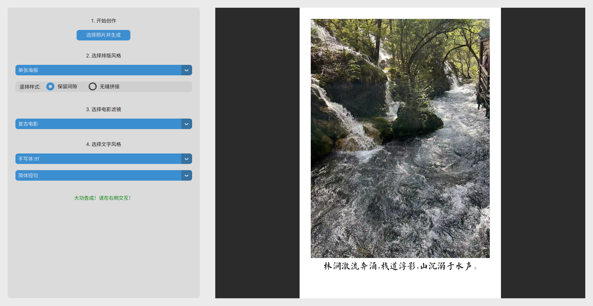

# AI电影感拼图工具 (AI Cinematic Collage 

一个桌面应用程序，它结合了多种照片布局、电影感滤镜和AI赋文功能，能将您的普通照片一键转化为富有故事性和艺术感的电影风格图片。



---

## 项目起源

本项目源于一个清晰而富有创意的初始构想。以下是最初设定的核心功能要求，也是我们整个开发过程遵循的蓝图：

1.  **图片输入:** 用户能够输入三张或四张照片作为素材。
2.  **布局选择:** 用户可以选择不同的照片排版方式，例如：
    * 像电影胶片一样，三张竖着排列，中间留有空隙。
    * 将多张照片直接无缝拼接在一起。
    * 对单张照片应用带有宽边框的画廊/海报效果。
    * 整体风格追求“电影氛围感”。
3.  **滤镜应用:** 用户可以从几个预设的电影感滤镜中选择一个，应用到生成的图片上。
4.  **文字风格定义:** 用户能够选择最终成品上文字的风格，包括：
    * **字体:** 如手写体等不同字体。
    * **内容风格:** 如简体、繁体、英文、散文等。
5.  **AI赋文:**
    * 程序能将处理好的图片（含布局和滤镜）发送给带有视觉功能的大型语言模型（AI）。
    * AI识别每张图片的内容和氛围后，为**每一张照片**生成对应的、富有氛围感的文字。

---

## 🌟 主要功能与特色 (Features)

经过我们的逐步迭代和优化，当前版本的程序不仅实现了所有原始需求，还包含了许多增强功能：

*   **交互式图片预览:** 在右侧预览区，可以**使用鼠标滚轮进行缩放**，**按住左键进行拖动**，方便查看图片细节。
*   **模块化布局系统:**
    *   **电影竖排:** 精心设计的胶卷风格，两侧带有齿孔，并支持“保留间隙”和“无缝拼接”两种子样式。
    *   **单张海报:** 优雅的非对称“拍立得/画廊打印”风格，底部有宽大的留白。
*   **专业级滤镜引擎:**
    *   通过独立的 `luts` 文件夹管理，您可以轻松添加或替换任何 `.cube` 格式的LUT调色预设文件。
*   **AI智能赋文:**
    *   通过独立的 `ai_connector.py` 模块，可配置连接到任何兼容OpenAI格式的API服务商。
    *   通过 `.env` 文件安全管理API密钥和服务器地址。
    *   根据用户选择的内容风格，动态生成最合适的指令（Prompt）。
    *   对AI返回的异常（如空回复、非标准格式）有强大的容错处理能力。
*   **完全自定义的文字系统:**
    *   通过 `fonts` 文件夹支持加载任意 `.ttf` / `.otf` 字体。
    *   实现了智能的、按字符换行的算法，完美支持中英文长句的优雅排版。
*   **现代化的代码架构:**
    *   项目被重构为 `main.py` (启动器), `app_ui.py` (界面逻辑), `layouts.py` (图像处理), `ai_connector.py` (AI通讯) 四个模块，结构清晰，易于维护和扩展。
*   **美观的图形界面:**
    *   基于 `customtkinter` 构建，拥有现代、美观且支持主题切换的UI。

---

## 🚀 安装与运行 (Installation & Usage)

### 1. 准备环境 (Prerequisites)
*   确保您的电脑已安装 Python 3.8 或更高版本。
*   本项目建议在虚拟环境中运行，以隔离依赖。

### 2. 项目设置 (Project Setup)
1.  克隆或下载本项目到本地。
2.  在项目根目录内，手动创建两个空文件夹：
    *   `luts`
    *   `fonts`
3.  下载您喜欢的 `.cube` 滤镜文件，放入 `luts` 文件夹。
4.  下载您喜欢的 `.ttf` 或 `.otf` 字体文件，放入 `fonts` 文件夹。

### 3. 安装依赖 (Install Dependencies)
在您的终端或命令行中，进入项目根目录，运行以下命令来安装所有必需的库：
```bash
pip install -r requirements.txt
```

### 4. 配置API密钥 (Configure API Key)
1.  在项目根目录下，找到 `.env.example` 文件。
2.  复制该文件并重命名为 `.env`。
3.  打开 `.env` 文件，填入您的AI服务商提供的信息：
    ```env
    OPENAI_API_KEY="您的API密钥"
    OPENAI_API_BASE="您的API服务器地址"
    ```


### 5. 运行程序 (Run the Application)
一切准备就绪后，在终端中运行以下命令即可启动程序：
```bash
python main.py
```

---

## 📂 项目结构 (Project Structure)

```
PhotoMagic/
├── .idea/            # IDE配置 (被.gitignore忽略)
├── .venv/            # Python虚拟环境 (被.gitignore忽略)
├── fonts/            # 存放自定义字体 (.ttf, .otf)
├── luts/             # 存放滤镜文件 (.cube)
├── __pycache__/      # Python缓存 (被.gitignore忽略)
├── .env              # 存储API密钥和配置 (被.gitignore忽略)
├── .env.example      # .env文件的示例模板
├── .gitignore        # 定义了Git应忽略的文件和目录
├── ai_connector.py   # 模块：负责与AI模型API通信
├── app_ui.py         # 模块：负责构建和管理图形用户界面 (GUI)
├── layouts.py        # 模块：负责所有图像处理，包括布局、滤镜、文字绘制
├── main.py           # 程序主入口
├── Readme.md         # 项目说明文档
└── requirements.txt  # 项目依赖库列表
```

---

## 🔧 未来可扩展方向 (Future Development)
*   **灵活图片数量:** 为“电影竖排”布局增加支持2张、4张等不同数量照片的逻辑。
*   **更多布局:** 添加如“四宫格”、“长图拼接”等新的布局模块。
*   **UI内直接管理:** 在程序界面内增加管理字体和滤镜的功能，而无需手动操作文件夹。

---
*项目作者：https://github.com/woyaoxingfua 。*
